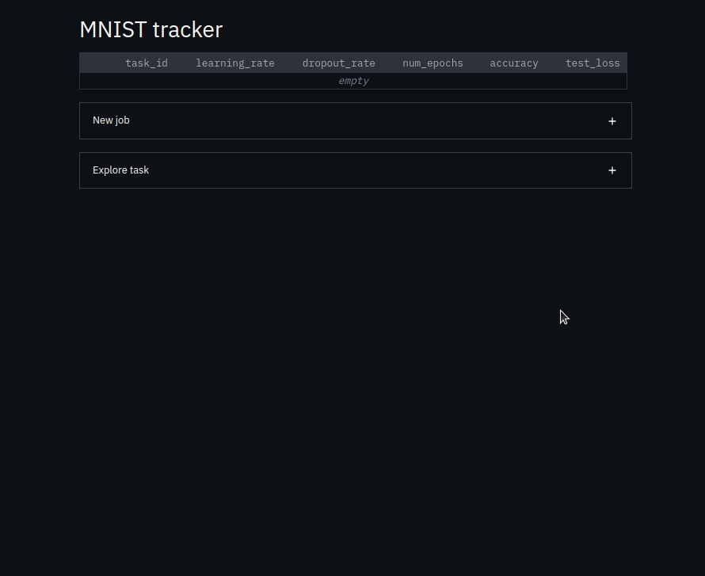

# DL management system
Build a mini experiment management system that helps to select the best model for a simple MNIST challenge.



## Get started
- Install requirements.txt 
```
pip install -r requirements.txt
```
- Run `app.py`
```
streamlit run app.py
```
- Hyper-parameters for users to tune : `learning_rate`, `dropout_rate`, `num_epochs`

- Submit job to MNIST tracker table. Cannot submit if exactly same job has been run.

- Experiments are sortable by column in MNIST tracker table. 